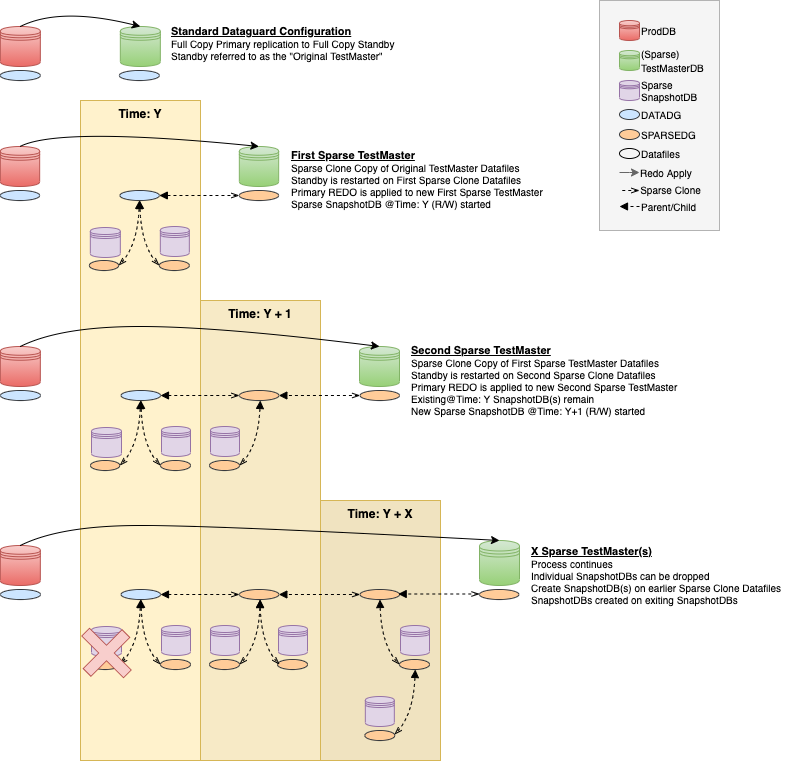

# Overview
> **WARNING**: Code available here is _NOT_ Production ready and in some cases, pseudo-only.  _Use at your own risk!_

Oracle Exadata Snapshots provide space efficent clones of Oracle Databases for testing/development (non-Production) purposes while leveraging Exadata performance and availability features.  Exadata Snapshots can be created at the PDB, CDB, or non-CDB level, and depending on the requirements, at point-in-time.

Main benefits over other solutions include:
* Utilises existing, familiar Oracle technologies (Dataguard/Goldengate)
* No additional network requirements
* No network latency impacting performance (I/O bus is not Ethernet)
* No 3rd-Party black-box appliances
* Offers full end-to-end performance and high availability (HA) testing

More information about Exadata Snapshots can be found in the [Official Documentation](https://docs.oracle.com/en/engineered-systems/exadata-database-machine/sagug/exadata-storage-server-snapshots.html#GUID-78F67DD0-93C8-4944-A8F0-900D910A06A0)

## Observations and Considerations
* Controlfiles and Online REDO are always FULL (not Sparse Copies).  Keep this in mind in regards to diskspace, especially around Online REDO sizes.
* The Offical Documentation demonstrates new ASM directories in the SPARSE Diskgroup for each SnapshotDB.  This is not required as datafiles can be uniquely named during the sparse clones and placed in a single ASM directory.  Creating new directories will require interaction with ASM to both create the new directory and grant ACL access.  
* The strategy taken in regards to ASM directories may simplify or complicate cleanup activities depending on the requirements.
* For Point-In-Time Scenarios, you must maintain the files generated during each Sparse TestMaster creation in order to create SnapshotDBs on older TestMaster files.  This is required as new Production (Primary) datafiles/PDBs may be replicated to the active Sparse TestMaster.
* The Dataguard database used for cloning can be replicated from the Primary (use Maximum Availability to avoid compromising the availability) or from another Standby.
* With an Active Dataguard License, the Datagaurd database used for cloning can be Opened Read-Only if required.


# Scenarios
## Prerequisites
**Exadata and Sparse Diskgroup**
* Oracle Exadata Database Machine with Sparse Diskgroups  
* 19.11+ RDBMS version.  Minimum Patch Level: RDBMS_19.11.0.0.0DBRU_LINUX.X64_210223
 (`$ORACLE_HOME/OPatch/datapatch -version`)

**ASM Access Control**

As the `grid` OS user, log into ASM as SYSASM and enable access control for the `oracle` user on the DATA and SPRC diskgroups, for example:
```
sqlplus / as sysasm
alter diskgroup DATAC1 set attribute 'ACCESS_CONTROL.ENABLED'='TRUE';
alter diskgroup DATAC1 add user 'oracle';
alter diskgroup SPRC1 set attribute 'ACCESS_CONTROL.ENABLED'='TRUE';
alter diskgroup SPRC1 add user 'oracle';

REM Verify 
select g.name, u.os_name 
  from v$asm_user u, v$asm_diskgroup g 
 where g.group_number = u.group_number;
```

## CDB/non-CDB Point-in-Time Snapshots
This process uses Oracle Dataguard to create multiple point-in-time Sparse Snapshots of a CDB or non-CDB.


### Process
#### **Physical Standby**
A Physical Standby must exist as this will become the "Original Test Master".  The Standby database should be properly registered with CRS as a PHYSICAL_STANDBY, and in the Dataguard Broker configuration using its DB_UNIQUE_NAME.

#### **Create the First Sparse TestMaster**
Using the full_sparse_tm.ksh code, specify the DB_NAME of the Standby, the directory to store helper files, and the ASM Sparse Diskgroup name, for example:

```full_sparse_tm.ksh -a TMORIGINAL -b /u01/app/oracle/sparse -c +SPRC1```

The above will take the TMORIGINAL standby database, create helper files post-fixed with DDMMYYYYHHMI in the /u01/app/oracle/sparse/TMORIGINAL directory and create the First Sparse TestMaster.

Repeat the same command for each additional Sparse TestMaster created over time.

#### **Create Sparse Snapshot Databases**
> **WARNING**: This is incomplete pseudo-code and _WILL NOT WORK_.  Use as a reference only.

Using the snapshot_db.ksh code, specify the DB_NAME of the Standby, the directory where the helper files are stored, the Date in DDMMYYYYHHMI format, and the new SnapshotDB name, for example:

```snapshot.ksh -a TMORIGINAL -b /u01/app/oracle/sparse -c 010920121754 -d SPARSE1```

The above will create a new SnapshotDB from the 010920121754 Sparse TestMaster.

# TODO 
Additional aspirations for this Git Repository:
* Formalise Code
* Provide Code for Cleaning up Snapshots
* More Scenarios:
    * PDB Only Point-in-Time using GoldenGate